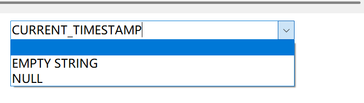

# springboot-vue-wms
springboot-vue-wms仓库管理系统
[Github项目地址](https://github.com/Wangchenfei7788/springboot-vue-wms.git)
## 项目描述：
- 基于Vue和Spring Boot的前后端分离项目，提供仓库用户，物品，物品种类，记录以及物品出入管理等功能
### 实现功能：
#### 前端部分：
- 使用Vue.js作为前端框架，开发用户界面，包括登录，注册，主页，用户管理，管理员管理，仓库管理，记录管理，个人中心等页面。
- 使用Vue Router进行前端路由管理，实现页面之间的跳转和参数传递。
- 使用Vuex进行状态管理，实现数据的共享和权限管理。
- 使用Axios进行HTTP请求，与后端进行数据交互。
- 使用Element UI库进行UI组件和页面的开发
#### 后端部分：
- 使用Spring Boot作为后端框架，进行后端服务的开发。
- 使用MyBatis-Plus进行数据库操作，实现数据的增删改查分页等功能
- 使用MySQL作为数据库，存储用户信息、仓库信息，出入库信息等数据。

## bug修复
#### 1. 修复左侧导航菜单跟随右侧内容高度变化
https://www.cnblogs.com/lxn2/p/14452083.html
```vue
<script>
export default {
  name: "IndexHome",
  components: {HeaderHome, AsideHome},
  data() {
    return {
      menuHeight: {
        height: "100%",
        background: "#313888"
      },
    }
  },
  created() {
    //动态调整左侧菜单栏高度 document.documentElement.clientHeight
    var docHeight = document.body.scrollHeight;//获取页面高度
    this.menuHeight.height = docHeight - 10 + "px";
  },
}
</script>

<template>
  <el-container style="height: 100%;margin: 0;padding: 0; border: 1px solid #eee">
    <el-aside :width="aside_width" :style="menuHeight">
      <AsideHome></AsideHome>
    </el-aside>
  </el-container>
  </template>
```
#### 2. 修复vuex页面刷新数据丢失
四种方法参考 https://blog.csdn.net/bidepanm/article/details/124686409

vuex-persistedstate https://blog.csdn.net/qq_43340606/article/details/126020339

1. 安装vuex-persistedstate
```
npm install vuex-persistedstate --save
```
2. 在store/index.js引入配置
```js
import createPersistedState from 'vuex-persistedstate';
```
3.引入插件
```js
plugins: [createPersistedState({
        storage:window.sessionStorage//更改数据存储方式(默认储存方式为LocalStorage)
    })]
```
> LocalStorage和SessionStorage区别
> 
> LocalStorage: 存储的数据不会因浏览器选项卡/窗口关闭而删除(永不过期,不会自动删除)
> 
> SessionStorage:  一旦浏览器选项卡/窗口关闭，存储在其中的数据就会被删除
> 
> https://juejin.cn/post/7149380173027573767 https://blog.csdn.net/weixin_41863239/article/details/86679056
#### 3. 记录管理(record)中新增记录时createtime字段无法自动填充
参考 https://blog.csdn.net/liudachu/article/details/119545992
> 1.尝试修改数据库,修改后无效果
> 
> 2.mybatis-plus自动填充时间
> 
> 参考 https://blog.csdn.net/lsqingfeng/article/details/113241362
> 
> 实体类添加注解
> 
> 参考 https://blog.csdn.net/qq_40241957/article/details/101772536
>
> ```java
>    @ApiModelProperty("操作时间")
>    @JsonFormat(pattern = "yyyy-MM-dd HH:mm:ss",timezone = "GMT+8")
>    @TableField(fill = FieldFill.INSERT)//填充策略,插入填充字段
>    @DateTimeFormat(pattern = "yyyy-MM-dd HH:mm:ss")
>    private Date createtime;
>```
> MetaObjectHandler 实现类
> 
> 参考 https://blog.csdn.net/qq_42875345/article/details/113273533
> 
> MetaObjectHandler接口在插入或者更新数据的时候为字段指定默认值。
> ```java
> package com.wms.common;
> import com.baomidou.mybatisplus.core.handlers.MetaObjectHandler;
> import org.apache.ibatis.reflection.MetaObject;
> import org.springframework.stereotype.Component;
> 
> import java.util.Date;
>
> /**
> * 自动填充时间(record表的时间填充)
> */
>  @Component
>  public class MyMetaObjectHandler implements MetaObjectHandler {
> 
>  @Override
>  public void insertFill(MetaObject metaObject) {
>     this.setFieldValByName("createtime",  new Date(), metaObject);//对应字段名
> }
> /**
>   * 需要时配置,暂时不需要
> */
>  @Override
>   public void updateFill(MetaObject metaObject) {
>
>   }
>
>  }
> ```
### 后端功能实现
- 添加mybatis-plus依赖
```xml
        <dependency>
            <groupId>com.baomidou</groupId>
            <artifactId>mybatis-plus-boot-starter</artifactId>
            <version>3.4.1</version>
        </dependency>
```
- 创建数据库
```
/*
 Navicat MySQL Data Transfer

 Source Server         : localhost_3306
 Source Server Type    : MySQL
 Source Server Version : 80034 (8.0.34)
 Source Host           : localhost:3306
 Source Schema         : wms_mysql

 Target Server Type    : MySQL
 Target Server Version : 80034 (8.0.34)
 File Encoding         : 65001

 Date: 27/02/2024 15:57:11
*/
```
1. user表

| id |  no  | name  | password | age | sex |    phone    | role_id | isValid |
|:--:|:----:|:-----:|:--------:|:---:|:---:|:-----------:|:-------:|:-------:|
| 1  | root | 超级管理员 |   1234   | 20  |  1  | 17575878678 |    0    |    Y    |

```mysql
-- ----------------------------
-- Table structure for user
-- ----------------------------
DROP TABLE IF EXISTS `user`;
CREATE TABLE `user`  (
  `id` int NOT NULL AUTO_INCREMENT COMMENT '主键',
  `no` varchar(20) CHARACTER SET utf8mb3 COLLATE utf8mb3_general_ci NULL DEFAULT NULL COMMENT '账号',
  `name` varchar(100) CHARACTER SET utf8mb3 COLLATE utf8mb3_general_ci NOT NULL COMMENT '名字',
  `password` varchar(20) CHARACTER SET utf8mb3 COLLATE utf8mb3_general_ci NOT NULL COMMENT '密码',
  `age` int NULL DEFAULT NULL,
  `sex` int NULL DEFAULT NULL COMMENT '性别',
  `phone` varchar(20) CHARACTER SET utf8mb3 COLLATE utf8mb3_general_ci NULL DEFAULT NULL COMMENT '电话',
  `role_id` int NULL DEFAULT NULL COMMENT '⻆⾊ 0超级管理员，1管理员，2普通账号',
  `isValid` varchar(4) CHARACTER SET utf8mb3 COLLATE utf8mb3_general_ci NULL DEFAULT 'Y' COMMENT '是否有效，Y有效，其他⽆效',
  PRIMARY KEY (`id`) USING BTREE
) ENGINE = InnoDB AUTO_INCREMENT = 22 CHARACTER SET = utf8mb3 COLLATE = utf8mb3_general_ci ROW_FORMAT = Dynamic;
```
2. menu表

| id | menuCode | menuName | menuLevel | menuParentCode | menuClick  | menuRight | menuComponent | menuIcon |
|:--:|:--------:|:--------:|:---------:|:--------------:|:----------:|:---------:|:-------------:|:--------:|
| 1  |   001    | 超级管理员管理  |     1     |      Null      | RootManger |     0     |root/RootManger.vue|el-icon-s-custom|
```mysql
-- ----------------------------
-- Table structure for menu
-- ----------------------------
DROP TABLE IF EXISTS `menu`;
CREATE TABLE `menu`  (
  `id` int NOT NULL,
  `menuCode` varchar(8) CHARACTER SET utf8mb3 COLLATE utf8mb3_general_ci NULL DEFAULT NULL COMMENT '菜单编码',
  `menuName` varchar(16) CHARACTER SET utf8mb3 COLLATE utf8mb3_general_ci NULL DEFAULT NULL COMMENT '菜单名字',
  `menuLevel` varchar(2) CHARACTER SET utf8mb3 COLLATE utf8mb3_general_ci NULL DEFAULT NULL COMMENT '菜单级别',
  `menuParentCode` varchar(8) CHARACTER SET utf8mb3 COLLATE utf8mb3_general_ci NULL DEFAULT NULL COMMENT '菜单的父code',
  `menuClick` varchar(16) CHARACTER SET utf8mb3 COLLATE utf8mb3_general_ci NULL DEFAULT NULL COMMENT '点击触发的函数',
  `menuRight` varchar(8) CHARACTER SET utf8mb3 COLLATE utf8mb3_general_ci NULL DEFAULT NULL COMMENT '权限 0超级管理员，1表示管理员，2表示普通用户，可以用逗号组合使用',
  `menuComponent` varchar(200) CHARACTER SET utf8mb3 COLLATE utf8mb3_general_ci NULL DEFAULT NULL,
  `menuIcon` varchar(100) CHARACTER SET utf8mb3 COLLATE utf8mb3_general_ci NULL DEFAULT NULL,
  PRIMARY KEY (`id`) USING BTREE
) ENGINE = InnoDB CHARACTER SET = utf8mb3 COLLATE = utf8mb3_general_ci ROW_FORMAT = DYNAMIC;
```
3. goodtype表

| id | name | remark |
|:--:|:----:|:------:|
| 1  | 数码产品 | 手机、电脑  |
```mysql
-- ----------------------------
-- Table structure for goodtype
-- ----------------------------
DROP TABLE IF EXISTS `goodtype`;
CREATE TABLE `goodtype`  (
  `id` int NOT NULL AUTO_INCREMENT COMMENT '主键',
  `name` varchar(100) CHARACTER SET utf8mb3 COLLATE utf8mb3_general_ci NOT NULL COMMENT '分类名',
  `remark` varchar(1000) CHARACTER SET utf8mb3 COLLATE utf8mb3_general_ci NULL DEFAULT NULL COMMENT '备注',
  PRIMARY KEY (`id`) USING BTREE
) ENGINE = InnoDB AUTO_INCREMENT = 3 CHARACTER SET = utf8mb3 COLLATE = utf8mb3_general_ci ROW_FORMAT = DYNAMIC;
```
4. good表

| id |   name    | storage | goodType | count | remark |
|:--:|:---------:|:-------:|:--------:|:-----:|:------:|
| 1  | Xiaomi 13 |    1    |    1     |  45   |   手机   |
```mysql
-- ----------------------------
-- Table structure for good
-- ----------------------------
DROP TABLE IF EXISTS `good`;
CREATE TABLE `good`  (
  `id` int NOT NULL AUTO_INCREMENT COMMENT '主键',
  `name` varchar(100) CHARACTER SET utf8mb3 COLLATE utf8mb3_general_ci NOT NULL COMMENT '货名',
  `storage` int NOT NULL COMMENT '仓库',
  `goodType` int NOT NULL COMMENT '分类',
  `count` int NULL DEFAULT NULL COMMENT '数量',
  `remark` varchar(1000) CHARACTER SET utf8mb3 COLLATE utf8mb3_general_ci NULL DEFAULT NULL COMMENT '备注',
  PRIMARY KEY (`id`) USING BTREE
) ENGINE = InnoDB AUTO_INCREMENT = 5 CHARACTER SET = utf8mb3 COLLATE = utf8mb3_general_ci ROW_FORMAT = DYNAMIC;
```
5. storage表

| id | name | remark |
|:--:|:----:|:------:|
| 1  | 上海仓库 |  上海地区  |
```mysql
-- ----------------------------
-- Table structure for storage
-- ----------------------------
DROP TABLE IF EXISTS `storage`;
CREATE TABLE `storage`  (
  `id` int NOT NULL AUTO_INCREMENT COMMENT '主键',
  `name` varchar(100) CHARACTER SET utf8mb3 COLLATE utf8mb3_general_ci NOT NULL COMMENT '仓库名',
  `remark` varchar(1000) CHARACTER SET utf8mb3 COLLATE utf8mb3_general_ci NULL DEFAULT NULL COMMENT '备注',
  PRIMARY KEY (`id`) USING BTREE
) ENGINE = InnoDB AUTO_INCREMENT = 4 CHARACTER SET = utf8mb3 COLLATE = utf8mb3_general_ci ROW_FORMAT = DYNAMIC;
```
6. record表

| id | good | userId | adminId | count | createtime | remark |
|:--:|:----:|:------:|:-------:|:-----:|:----------:|:------:|
| 1  |  1   |   3    |    2    |  20   |    2023-09-09 22:01:37     |   入库   |
```mysql
-- ----------------------------
-- Table structure for record
-- ----------------------------
DROP TABLE IF EXISTS `record`;
CREATE TABLE `record`  (
  `id` int UNSIGNED NOT NULL AUTO_INCREMENT COMMENT '主键',
  `good` int NOT NULL COMMENT '货品id',
  `userId` int NULL DEFAULT NULL COMMENT '取货人/补货人',
  `adminId` int NULL DEFAULT NULL COMMENT '操作人id',
  `count` int NULL DEFAULT NULL COMMENT '数量',
  `createtime` timestamp NULL DEFAULT CURRENT_TIMESTAMP ON UPDATE CURRENT_TIMESTAMP COMMENT '创建时间',
  `remark` varchar(1000) CHARACTER SET utf8mb3 COLLATE utf8mb3_general_ci NULL DEFAULT NULL COMMENT '备注',
  PRIMARY KEY (`id`) USING BTREE
) ENGINE = InnoDB AUTO_INCREMENT = 26 CHARACTER SET = utf8mb3 COLLATE = utf8mb3_general_ci ROW_FORMAT = DYNAMIC;
```
- application.yml 前后端交互配置
```yml
server:
 port: 8090
 
spring:
 datasource:
  url: jdbc:mysql://localhost:3306/wms_mysql?useUnicode=true&characterEncoding=utf-8&useSSL=false&serverTimezone=GMT%2B8
  driver-class-name: com.mysql.cj.jdbc.Driver
  username: root
  password: 123456
```
### mybatis-plus代码生成
代码生成器（新） https://baomidou.com/pages/779a6e/
1. 依赖注入
```xml
        <dependency>
            <groupId>org.freemarker</groupId>
            <artifactId>freemarker</artifactId>
            <version>2.3.30</version>
        </dependency>
        <dependency>
            <groupId>com.spring4all</groupId>
            <artifactId>spring-boot-starter-swagger</artifactId>
            <version>1.5.1.RELEASE</version>
        </dependency>
        <dependency>
            <groupId>com.baomidou</groupId>
            <artifactId>mybatis-plus-generator</artifactId>
            <version>3.5.3.1</version>
        </dependency>
```
2. 生成器代码
- MysqlGenerator.java
```java
package com.wms.common;
import com.baomidou.mybatisplus.annotation.FieldFill;
import com.baomidou.mybatisplus.generator.FastAutoGenerator;
import com.baomidou.mybatisplus.generator.config.DataSourceConfig;
import com.baomidou.mybatisplus.generator.config.OutputFile;
import com.baomidou.mybatisplus.generator.engine.FreemarkerTemplateEngine;
import com.baomidou.mybatisplus.generator.fill.Column;
import lombok.extern.slf4j.Slf4j;

import java.util.Arrays;
import java.util.Collections;
import java.util.List;

@Slf4j
public class MysqlGenerator {
    /**
     * 数据源配置（修改成MySQL）
     */
    protected static String URL = "jdbc:mysql://localhost:3306/wms_mysql?userSSL=false&serverTimezone=Asia/Shanghai&useUnicode=true&characterEncoding=utf-8&allowPublicKeyRetrieval=true";
    protected static String USERNAME = "root";
    protected static String PASSWORD = "123456";
    //protected static String DRIVERNAME = "com.mysql.cj.jdbc.Driver";

    protected static DataSourceConfig.Builder DATA_SOURCE_CONFIG = new DataSourceConfig.Builder(URL, USERNAME, PASSWORD);

    // 处理 all 情况
    /**
     * 交互式的生成器（all）
     * @param tables
     * @return
     */
    protected static List<String> getTables(String tables) {
        return "all".equals(tables) ? Collections.emptyList() : Arrays.asList(tables.split(","));
    }

    public static void main(String[] args) {
        FastAutoGenerator.create(DATA_SOURCE_CONFIG)
               //全局配置
                .globalConfig((scanner,builder) ->
                               //builder就是globalConfig的构建器
                                builder.fileOverride() //覆盖已生成文件
                                        .outputDir(System.getProperty("user.dir")+"\\wms\\src\\main\\java")
                                        .author(scanner.apply("请输入你的用户名"))
                                        .enableSwagger()
                                        .commentDate("yyyy-MM-dd")
                                        .build() //构建器开始工作
                )
                //包配置
                .packageConfig(builder-> {
                    builder
                            .parent("com.wms")
                            .entity("entity")
                            .service("service")
                            .serviceImpl("service.impl")
                            .mapper("mapper")
                            .xml("mapper.xml")
                            .controller("controller")
                            .pathInfo(Collections.singletonMap(OutputFile.xml, System.getProperty("user.dir") + "\\wms\\src\\main\\resources\\mapper"))
                            .build();
                })
                //注入配置
                .injectionConfig((builder) ->
                        builder.beforeOutputFile(
                                (a, b) -> log.warn("tableInfo: " + a.getEntityName())
                        )
                )
                //策略配置
                .strategyConfig((scanner, builder) ->
                        builder.addInclude(getTables(scanner.apply("请输入表名，多个英文逗号分隔？所有输入 all")))
                                .addTablePrefix("tb_")
                                .entityBuilder()
                                .enableChainModel()
                                .enableLombok()
                                .enableTableFieldAnnotation()
                                .addTableFills(
                                        new Column("create_time", FieldFill.INSERT)
                                )
                                .controllerBuilder()
                                .enableRestStyle()
                                .enableHyphenStyle()
                                .build())
                .templateEngine(new FreemarkerTemplateEngine())
                .execute();
    }
}
```
- 创建实体类
1. User.java
```java
package com.wms.entity;

import com.baomidou.mybatisplus.annotation.IdType;
import com.baomidou.mybatisplus.annotation.TableId;
import com.baomidou.mybatisplus.annotation.TableField;
import java.io.Serializable;
import io.swagger.annotations.ApiModel;
import io.swagger.annotations.ApiModelProperty;
import lombok.Data;
import lombok.EqualsAndHashCode;

/**
 * <p>
 * 
 * </p>
 *
 * @author wms
 * @since 2023-08-10
 */
@Data
@EqualsAndHashCode(callSuper = false)
@ApiModel(value="User对象", description="")
public class User implements Serializable {

    private static final long serialVersionUID = 1L;

    @ApiModelProperty(value = "主键")
    @TableId(value = "id", type = IdType.AUTO)
    private Integer id;

    @ApiModelProperty(value = "账号")
    private String no;

    @ApiModelProperty(value = "名字")
    private String name;

    @ApiModelProperty(value = "密码")
    private String password;

    private Integer age;

    @ApiModelProperty(value = "性别")
    private Integer sex;

    @ApiModelProperty(value = "电话")
    private String phone;

    @ApiModelProperty(value = "⻆⾊ 0超级管理员，1管理员，2普通账号")
    private Integer roleId;

    @ApiModelProperty(value = "是否有效，Y有效，其他⽆效")
    @TableField("isValid")
    private String isvalid;
    
}
```


